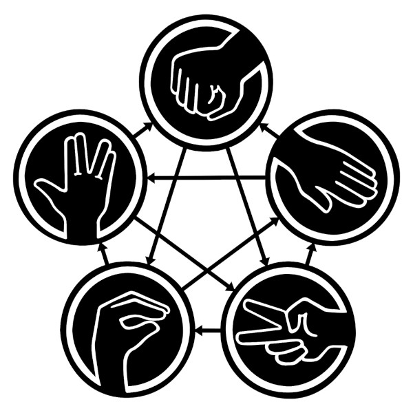

# React Socket.io Multiplayer Game

A variation of the classic Rock Paper Scissors inspired by the popular TV Series "The Big Bang Theory".

[PREVIEW](https://rock-paper-scissors-plus.herokuapp.com/)

## Rock Paper Scissors Lizard Spock

This game is a variation of the classic Rock Paper Scissors with two more moves: Lizard and Spock.

Every move beats two other moves, keeping the game at the same time balanced and making it less predictable, especially if you know very well your opponents.

Rules:

>Scissors cuts paper, paper covers rock, rock crushes lizard, lizard poisons Spock, Spock smashes scissors, scissors decapitates lizard, lizard eats paper, paper disproves Spock, Spock vaporizes rock, and as it always has, rock crushes scissors.

The following diagram shows how it works:

## Tech stack

This projects has been developed using:

- NPM
- Socket.io
- Create React App
  - React (with Hooks)
  - TypeScript
  - React Testing Library
- Bulma
- SVG
- Heroku
